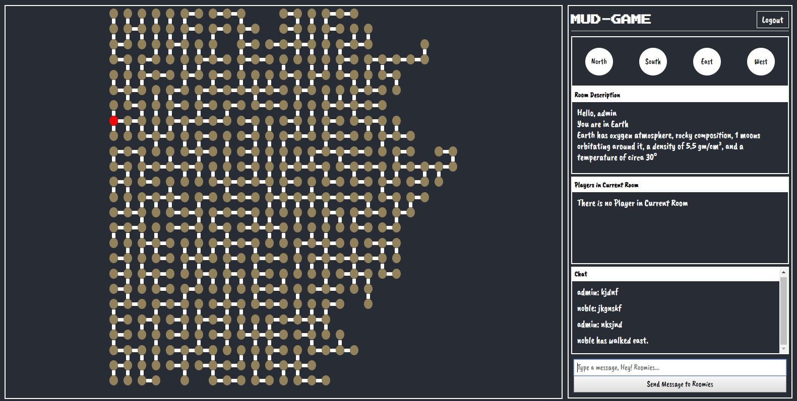

# MUD-GAME

[https://mud-game.netlify.com](https://mud-game.netlify.com)

### What is a MUD?

> A MUD...is a multiplayer real-time virtual world, usually text-based. MUDs combine elements of role-playing games, hack and slash, player versus player, interactive fiction, and online chat. Players can read or view descriptions of rooms, objects, other players, non-player characters, and actions performed in the virtual world. Players typically interact with each other and the world by typing commands that resemble a natural language. - Wikipedia

With the adventure game built in previous weeks, you have already created an application containing some of these elements (rooms, descriptions, objects, players, etc.). In this project, we will be expanding these worlds to be more interactive, provide new actions for players, display world info on a professional client site, and run the world's server on a hosted site to allow multi-player functionality.



## Getting Started

These instructions will get you a copy of the project up and running on your local machine.

### Prerequisites

You will need [node](https://nodejs.org/en/download/) and `npm` installed on your machine.

## Installation and Setup Instructions

Clone down this repository.

Change directory

Create `.env` in the root directory of your project

```
REACT_APP_API_HOST = <API link>
REACT_APP_PUSHER_KEY= <pusher key>
REACT_APP_PUSHER_CLUSTER=<pusher cluster>
```

Installation:

`npm install`

To Start Server:

`npm start`

To visit app on localhost:

`https://localhost:3000`

### Pusher

WebSocket is a computer communications protocol, providing full-duplex communication channels over a single TCP connection. You may use the Pusher service to handle the WebSocket connections as a stretch goal for your project. You can read more about them [here](https://pusher.com/websockets).

#### Set up a Pusher account

- Sign up for a free account on pusher.com
- Create a new app
- Take note of your credentials
  - app_id, key, secret, cluster
- Look through the provided sample code and documentation
